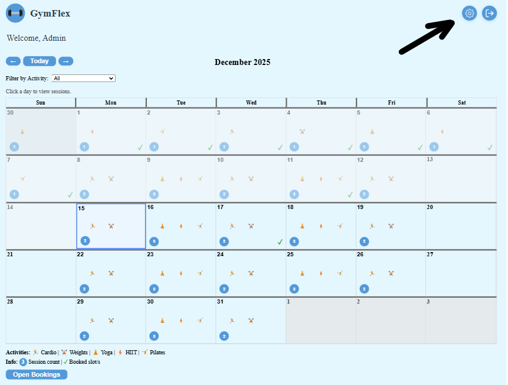
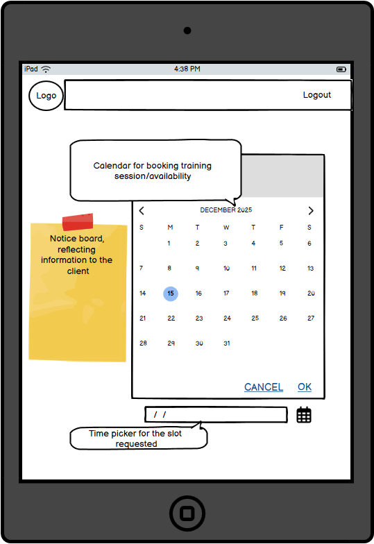
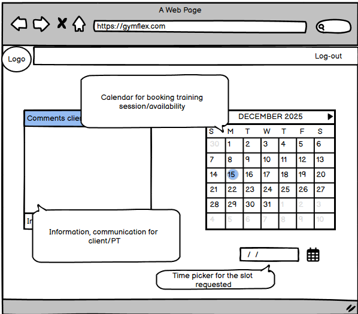
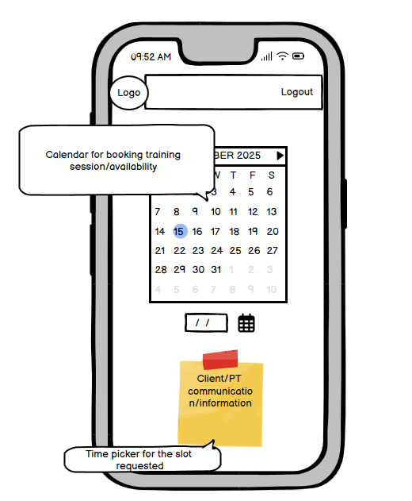

# Introduction

GymFlex is about connection and convenience. By combining user accounts, personalised timetables, and trainer-managed sessions, the application becomes a central hub for gym clients and trainers alike.

Whether you're a regular gym-goer managing weekly sessions or a trainer coordinating multiple classes, GymFlex provides clarity, control, and efficiency.

Please find the link below to the site

Production (Heroku) app: https://gymflex-5bb1d582f94c.herokuapp.com/  

## Table of Contents

- [Introduction](#introduction)
  - [Table of Contents](#table-of-contents)
  - [Strategy (Why?)](#strategy-why)
  - [Scope (What?)](#scope-what)
    - [Functional Requirements](#functional-requirements)
    - [Content Requirements](#content-requirements)
  - [Structure (How is it organised?)](#structure-how-is-it-organised)
    - [Information Architecture](#information-architecture)
    - [Skeleton (Layout and Interaction)](#skeleton-layout-and-interaction)
  - [Features](#features)
  - [Admin Access](#admin-access)
  - [Technologies Used](#technologies-used)
- [Skeleton (Wireframes \& Layout)](#skeleton-wireframes--layout)
- [Surface (Visual Design)](#surface-visual-design)
    - [Colour Palette](#colour-palette)
    - [Typography](#typography)
    - [Accessibility](#accessibility)
  - [Testing Overview](#testing-overview)
    - [Deployed Test Environment](#deployed-test-environment)
      - [Smoke Test (Production)](#smoke-test-production)
  - [Development Checklist](#development-checklist)
    - [Authentication \& User Management](#authentication--user-management)
    - [Sessions \& Booking](#sessions--booking)
    - [User Profiles](#user-profiles)
    - [Trainer/Admin Features](#traineradmin-features)
    - [Future Enhancements](#future-enhancements)
  - [Database Structure](#database-structure)
    - [User Table (`auth_user`)](#user-table-auth_user)
    - [Session Table (`Session`)](#session-table-session)
    - [SessionAttendee Table (`SessionAttendee`)](#sessionattendee-table-sessionattendee)
    - [Relationships](#relationships)
  - [Installation / Setup](#installation--setup)
    - [1. Clone the repository](#1-clone-the-repository)
    - [2. Create a virtual environment (optional but recommended)](#2-create-a-virtual-environment-optional-but-recommended)
- [Activate it:](#activate-it)
- [Windows](#windows)
- [macOS/Linux](#macoslinux)
    - [3. Install dependencies](#3-install-dependencies)
    - [4. Apply database migrations](#4-apply-database-migrations)
    - [5. Create a superuser (optional, for admin access)](#5-create-a-superuser-optional-for-admin-access)
    - [6. Run the development server](#6-run-the-development-server)
    - [Frontend (React)](#frontend-react)
    - [1. Navigate to the frontend folder:](#1-navigate-to-the-frontend-folder)
    - [2. Install dependencies:](#2-install-dependencies)
    - [3. Start the React development server:](#3-start-the-react-development-server)
  - [Key Outline](#key-outline)
  - [Future Enhancements](#future-enhancements-1)
- [GymFlex Deployment Guide](#gymflex-deployment-guide)
  - [Prerequisites](#prerequisites)
  - [Steps](#steps)
    - [1. Create a Heroku App](#1-create-a-heroku-app)
    - [2. Add PostgreSQL Add-on](#2-add-postgresql-add-on)
    - [3. Set Environment Variables](#3-set-environment-variables)
    - [4. Prepare Your Django App](#4-prepare-your-django-app)
    - [5. Collect Static Files](#5-collect-static-files)
    - [6. Apply Database Migrations](#6-apply-database-migrations)
    - [7. Push Code to Heroku](#7-push-code-to-heroku)
    - [8. Open the App](#8-open-the-app)
    - [Optional: Monitor Logs](#optional-monitor-logs)
  - [Tips](#tips)
  - [Author](#author)
  - [Restoring Development Data](#restoring-development-data)
  - [Credits](#credits)

---

## Strategy (Why?)

GymFlex aims to:

* Centralise access to gym schedules and session booking
* Provide a clean, intuitive interface for both clients and trainers
* Offer personalised views of booked sessions, upcoming classes, and availability
* Serve as a hub for communication between clients and trainers

**Target Users:**
Gym clients, personal trainers, and gym administrators looking for a streamlined way to manage bookings, timetables, and communications.

---

## Scope (What?)

### Functional Requirements

* User registration and profile management
* Session booking, cancellations, and history tracking
* Timetable display for sessions, trainers, and rooms
* Trainer interface to manage sessions, view bookings, and communicate with clients

### Content Requirements

* User account data and preferences
* Session details (title, trainer, date, time, capacity)
  
---

## Structure (How is it organised?)

The platform is structured around key user flows:

* Discover → Book → Attend
* Book → Track → Review

### Information Architecture

* Home
* Timetable
* My Bookings
* Trainer Dashboard (for trainers)

---

### Skeleton (Layout and Interaction)

* Built primarily with React for dynamic rendering and reusable components
* Bootstrap used for responsive layout and navigation
* Custom CSS applied for timetable cards, buttons, and notifications
* Semantic HTML ensures content is structured meaningfully and remains accessible

**UI Elements:**

* Timetable cards show session title, time, trainer, and availability at a glance
* Booking buttons allow clients to reserve or cancel spots easily
* Trainer panels provide modals for editing session details without leaving the page
* Notifications inform clients of upcoming sessions or changes

---

## Features

* User registration and authentication
* Trainer and client profile management
* Create, view, edit, and cancel bookings (CRUD functionality)
* Interactive calendar view for gym sessions powered by react-big-calendar
* Toast notifications for user feedback (booking confirmations, errors)
* Activity filtering on calendar with visual emoji indicators
* Responsive front-end built with React, Bootstrap, and custom CSS
* Secure, relational data handling via Django REST Framework
* Deployed on Heroku with a managed relational database (PostgreSQL)

---

## Admin Access

If you are logged in as an admin user, you can access the Django admin panel to manage users, sessions, and bookings.

- Click the "Admin" button in the navigation bar (see screenshot below).
- Or, go directly to `/admin/` (e.g., http://localhost:8000/admin).



Use your admin credentials to log in.

---

## Technologies Used

* **Frontend:** HTML, CSS, JavaScript, React (Vite), Bootstrap, react-big-calendar, react-hot-toast
* **Backend:** Django (Python), Django REST Framework (DRF)
* **Database:** SQLite (development) / PostgreSQL (production)
* **Hosting:** Heroku
* **Version Control:** Git & GitHub
* **Authentication:** JWT (JSON Web Token)

---

# Skeleton (Wireframes & Layout)

Wireframes were created to guide the design and layout of GymFlex across devices. These visual blueprints helped ensure a consistent and user-friendly experience on all screen sizes.

**Tablet Wireframe:**



**Desktop Wireframe:**



**Mobile Wireframe:**



> **Notes Feature:**
> The Notes section (for trainers or users to add session notes) was not implemented in the initial release. This decision was made to prioritise delivering a fully working core project focused on booking, session management, and user experience. Notes functionality is planned for a future release, as it does not hinder the main use of the site and can be added without disrupting existing workflows.

---

# Surface (Visual Design)

The Surface plane defines the sensory experience of GymFlex, including visual design, color, typography, and accessibility.

### Colour Palette
GymFlex uses a calming blue theme to evoke trust, professionalism, and energy—perfect for a fitness platform. The colours promote a clean, modern look while ensuring accessibility.

- **Primary Blue** (#3498db): Used for buttons, links, and accents to draw attention and indicate interactivity.
- **Light Background** (#e0f7ff): Provides a fresh, airy feel for the main layout, creating a welcoming atmosphere.
- **Dark Text** (#2c3e50): Ensures high readability on light backgrounds, with a professional tone.
- **Success Green** (#4CAF50): For confirmations and positive feedback, like booking successes.
- **Error Red** (#e74c3c): For errors and warnings, providing clear visual cues.

### Typography
- **Font Family**: System fonts (-apple-system, BlinkMacSystemFont, 'Segoe UI', Roboto, sans-serif).
- **Why**: This stack leverages native OS fonts for optimal performance, faster loading (no external font requests), and better accessibility. It adapts to user preferences and devices, ensuring consistency and inclusivity without compromising speed or usability.

### Accessibility
GymFlex prioritises accessibility to ensure the app is usable by everyone, including users with disabilities. Key features include:

- **High Contrast Colours**: The blue theme provides sufficient contrast (e.g., #3498db on white meets WCAG AA standards) for readability.
- **Keyboard Navigation**: All interactive elements (buttons, links) are keyboard-accessible, with proper focus indicators.
- **Screen Reader Support**: Semantic HTML, ARIA labels, and alt text for images ensure compatibility with screen readers.
- **Responsive Design**: Mobile-friendly layout with scalable fonts and touch targets meeting minimum size requirements (44px).
- **Error Handling**: Clear, descriptive error messages and form validation to guide users.

These choices follow WCAG 2.1 guidelines, making the app inclusive and compliant.

These choices prioritise user experience, performance, visual harmony, and inclusivity, making the app feel responsive, trustworthy, and accessible.

---

## Testing Overview

To ensure GymFlex is reliable, user-friendly, and accessible across different devices and browsers, a comprehensive testing strategy was followed.  
The approach combined **Behaviour-Driven Development (BDD)** and **Test-Driven Development (TDD)** principles, focusing on both user experience and code reliability.

- **BDD** focused on real-world user scenarios, such as:  
  *“As a user, I want to book a gym session so that I can secure my spot in advance.”*

- **TDD** ensured that each feature was supported by automated tests written before implementation, improving long-term stability and maintainability.

This combined approach kept testing user-centred while maintaining strong technical quality and confidence in the codebase.  

For detailed information on all tests, validations, bugs, and results, please refer to the [TESTING.md](./TESTING.md) document.

### Deployed Test Environment
Production (Heroku) app: https://gymflex-5bb1d582f94c.herokuapp.com/  
API base URL: https://gymflex-5bb1d582f94c.herokuapp.com/api  
Use this environment for manual end-to-end verification (JWT login, session listing, booking/unbooking). Local development tests should continue to use `http://localhost:8000/api`. Note: if the dyno has been idle it may take a few seconds to “wake” on the first request.

#### Smoke Test (Production)
Run these quick steps after each deploy to verify core functionality:
1. Obtain tokens: `POST /api/token/` with valid JSON credentials; expect `200` and `{"access","refresh"}`.
2. List sessions: `GET /api/sessions/` with `Authorization: Bearer <access>`; expect `200` and an array. Confirm masking (trainer shows `TBA` if viewing an unbooked session as non-staff).
3. Book a session: `POST /api/sessions/{id}/book/` (same Authorization); expect `200` and `booked: true`, `available_slots` decrements.
4. Toggle (unbook): Repeat step 3 on same session; expect `booked: false`, `available_slots` increments.
5. Refresh token: `POST /api/token/refresh/` with `{"refresh": "<refresh>"}`; expect new `access`, then repeat step 2 to confirm continued authorised access.

Notes:
- Initial request may be slower due to Heroku dyno wake-up.
- If any step fails with `401`, check token expiry and repeat step 1.
- For debugging, compare the same endpoint locally (`http://localhost:8000/api/sessions/`) to distinguish deployment vs code issues.

## Development Checklist

This checklist shows what has been done and what is planned, all in one place for easy progress tracking. It is designed to help the development team (or yourself) maintain a clear overview of progress, identify what still needs work, and prioritise upcoming tasks. Each section is organised by major areas of functionality, with GitHub-flavoured checkboxes that can be ticked off as features are completed.  

The checklist is intended to serve multiple purposes:

- **Progress tracking:** Quickly see which features are implemented, in progress, or not started.  
- **Planning:** Outline the scope of work, break down tasks into manageable pieces, and plan next steps.  
- **Documentation:** Provide a live snapshot of project development for team members, supervisors, or portfolio purposes.  
- **Quality assurance:** Highlight areas where testing is needed, ensuring no functionality is overlooked.  

Use this checklist as a single source of truth for GymFlex development. Update it regularly as features move from “To Do” → “In Progress” → “Done.”


### Authentication & User Management
- [x] Django backend with REST Framework  
- [x] JWT authentication for login/logout  
- [x] React frontend with routing (React Router)  
- [x] Login page  
- [x] Logout functionality  
- [x] Registration page  
- [x] Protected routes for authenticated users  
- [x] LocalStorage storing access and refresh tokens  
- [x] 404 NotFound page  
- [x] Basic form and layout styling  

### Sessions & Booking
- [x] Timetable display for gym sessions, react-big-calendar  
- [x] Book session  
- [x] Cancel/unbook session  
- [x] View booking status/history  

### User Profiles
- [x] View profile details (username, membership type)  
- [x] Edit profile  
- [x] Display past bookings  

### Trainer/Admin Features
- [x] Create, edit, delete sessions  
- [x] View client bookings   

### Future Enhancements
- [x] Calendar view for trainers  
- [x] Improved responsive design and accessibility  

## Database Structure

GymFlex stores data in three main tables: **Users**, **Sessions**, and **SessionAttendee**.  
The database is normalised to avoid duplication and maintain clear relationships:

- Trainers (`is_staff=True`) can create and manage sessions.
- Clients can view sessions and book/unbook them.
- Each session is linked to a trainer and can have multiple attendees (tracked via the SessionAttendee join table).

---

### User Table (`auth_user`)
Stores all users, including trainers and clients.

| Field        | Description          |
| ------------ | -------------------- |
| id           | Primary Key          |
| username     | User’s username      |
| email        | Email address        |
| password     | Hashed password      |
| is_staff     | Trainer/admin flag   |
| is_superuser | Superuser/admin flag |

---

### Session Table (`Session`)
Stores all gym sessions.

| Field      | Description                                                     |
| ---------- | --------------------------------------------------------------- |
| id         | Primary Key                                                     |
| title      | Session name or type                                            |
| trainer_id | FK → `User.id` (who runs the session)                           |
| date       | Session date                                                    |
| time       | Session time                                                    |
| capacity   | Maximum number of clients                                       |
| attendees  | ManyToMany → Users who booked the session (via SessionAttendee) |

---

### SessionAttendee Table (`SessionAttendee`)
Tracks which users have booked which sessions. This is the join table for the many-to-many relationship between users and sessions, and also tracks attendance.

| Field    | Description                                 |
| -------- | ------------------------------------------- |
| id       | Primary Key                                 |
| user     | FK → `User.id` (the attendee)               |
| session  | FK → `Session.id` (the booked session)      |
| attended | Boolean, true if attended, false if no-show |

This table enables users to book multiple sessions and sessions to have multiple attendees, while also allowing tracking of attendance history.

---

### Relationships

- `trainer_sessions` links trainers to the sessions they run (One-to-Many).  
- `booked_sessions` links users to sessions they have booked (Many-to-Many).  
- Trainers can create/edit/delete sessions; clients can only view and book/unbook.  

## Installation / Setup

Follow these steps to set up GymFlex locally:

### 1. Clone the repository
git clone https://github.com/your-username/gymflex.git
cd gymflex

### 2. Create a virtual environment (optional but recommended)
python -m venv venv
# Activate it:
# Windows
venv\Scripts\activate
# macOS/Linux
source venv/bin/activate

### 3. Install dependencies
pip install -r requirements.txt

### 4. Apply database migrations
python manage.py migrate

### 5. Create a superuser (optional, for admin access)
python manage.py createsuperuser

### 6. Run the development server
python manage.py runserver

### Frontend (React)

### 1. Navigate to the frontend folder:
cd frontend

### 2. Install dependencies:
npm install

### 3. Start the React development server:
npm start

Visit in your browser: http://localhost:5173/

**Notes:**

* Make sure you have Python 3.11+ installed.
* Use `.env` for environment variables like `SECRET_KEY` and database settings.
* If using PostgreSQL locally, update `settings.py` with your local database credentials.

---

## Key Outline

GymFlex helps users manage their gym experience efficiently, solving common frustrations like missed sessions, unclear timetables, or difficulty communicating with trainers. The app enables users to:

* View and book gym sessions via a clear timetable
* Track personal bookings and session history
* Communicate with trainers about workouts or schedule changes
* Manage user profiles and account settings
* Allow trainers to manage sessions, view client bookings, and maintain the calendar

---

## Future Enhancements

* Email notifications for booking confirmations and reminders
* Note and feedback system for trainers
* Personalised workout plans based on goals and preferences
* Ratings and reviews for trainers
* Integration with payment systems
* Social media integration for sharing sessions and achievements
* Advanced search filters for finding specific sessions
* Group chat for trainers and clients to discuss workouts

---

# GymFlex Deployment Guide

This document explains how to deploy GymFlex to Heroku.

## Prerequisites

* Heroku account
* Git installed
* Python, Django, and project dependencies installed

## Steps

### 1. Create a Heroku App

```bash
heroku login
heroku create gymflex-app
```

### 2. Add PostgreSQL Add-on

```bash
heroku addons:create heroku-postgresql:hobby-dev
```

* Provides a free PostgreSQL database for production.
* Heroku automatically sets the DATABASE_URL environment variable.

### 3. Set Environment Variables

```bash
heroku config:set DEBUG=False
heroku config:set SECRET_KEY='your-secret-key'
heroku config:set ALLOWED_HOSTS='your-heroku-app.herokuapp.com'
```

* Include any other environment variables (e.g., JWT settings, API keys).

### 4. Prepare Your Django App

* Ensure requirements.txt and Procfile are present:

```text
# Procfile
web: gunicorn backend.wsgi
```

* Optionally, specify Python version in runtime.txt:

```text
python-3.11.8
```

### 5. Collect Static Files

```bash
heroku run python manage.py collectstatic --noinput
```

* Prepares all static files for production.

### 6. Apply Database Migrations

```bash
heroku run python manage.py migrate
```

### 7. Push Code to Heroku

```bash
git push heroku main
```

### 8. Open the App

```bash
heroku open
```

* Your GymFlex app should now be live.

### Optional: Monitor Logs

```bash
heroku logs --tail
```

* Useful for debugging deployment issues or server errors.

## Tips

* Make sure ALLOWED_HOSTS includes your Heroku domain.
* Configure django-cors-headers for your frontend domain if using React separately.
* Use whitenoise to serve static files in production.

---

*This README section is intended for developers deploying GymFlex to Heroku.*

## Author

Developed by Matthew Wilson as part of a web development learning project.

## Restoring Development Data

To quickly populate your local database with sample users, sessions, and bookings, run:

```powershell
python manage.py loaddata backend/users.json
python manage.py loaddata backend/sessions.json
python manage.py loaddata backend/attendees.json  # Loads booking data (SessionAttendee join table)
```


This will restore the core data for development and testing.

---

## Credits

This project was made possible with the help of the following resources:

- **React** (https://react.dev/) — Frontend framework
- **Vite** (https://vitejs.dev/) — Frontend tooling
- **Django** (https://www.djangoproject.com/) — Backend framework
- **Django REST Framework** (https://www.django-rest-framework.org/) — API layer
- **Simple JWT** (https://django-rest-framework-simplejwt.readthedocs.io/) — JWT authentication
- **Bootstrap** (https://getbootstrap.com/) — UI styling and layout
- **react-big-calendar** (https://github.com/jquense/react-big-calendar) — Calendar component
- **react-hot-toast** (https://react-hot-toast.com/) — Toast notifications
- **Heroku** (https://heroku.com/) — Hosting and deployment
- **W3C Validators** (https://validator.w3.org/ and https://jigsaw.w3.org/css-validator/) — HTML and CSS validation
- **Lighthouse** (https://developer.chrome.com/docs/lighthouse/overview/) — Accessibility and performance testing
- **GitHub** (https://github.com/) — Version control and collaboration

Icons, images, and other assets are either original, generated for this project, or used under open licenses as per their respective documentation.

Additional support and solutions were found via:
- **YouTube** — Video tutorials and walkthroughs for Django, React, and deployment
- **Stack Overflow** (https://stackoverflow.com/) — Community Q&A for troubleshooting and code examples
- **ChatGPT** — AI assistance for code explanations, debugging, and documentation.

