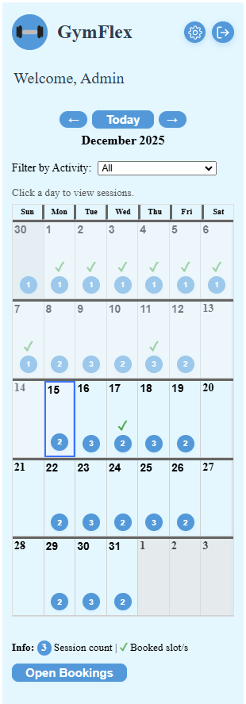
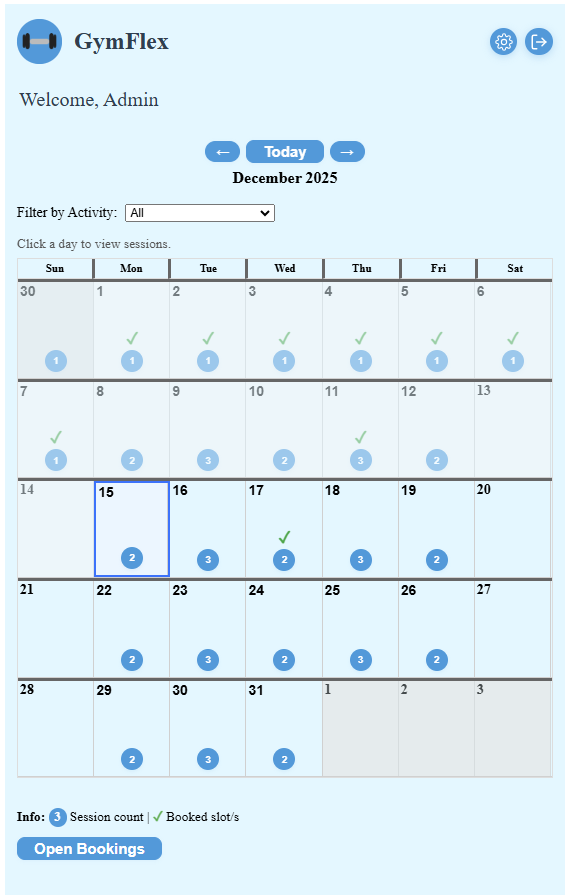
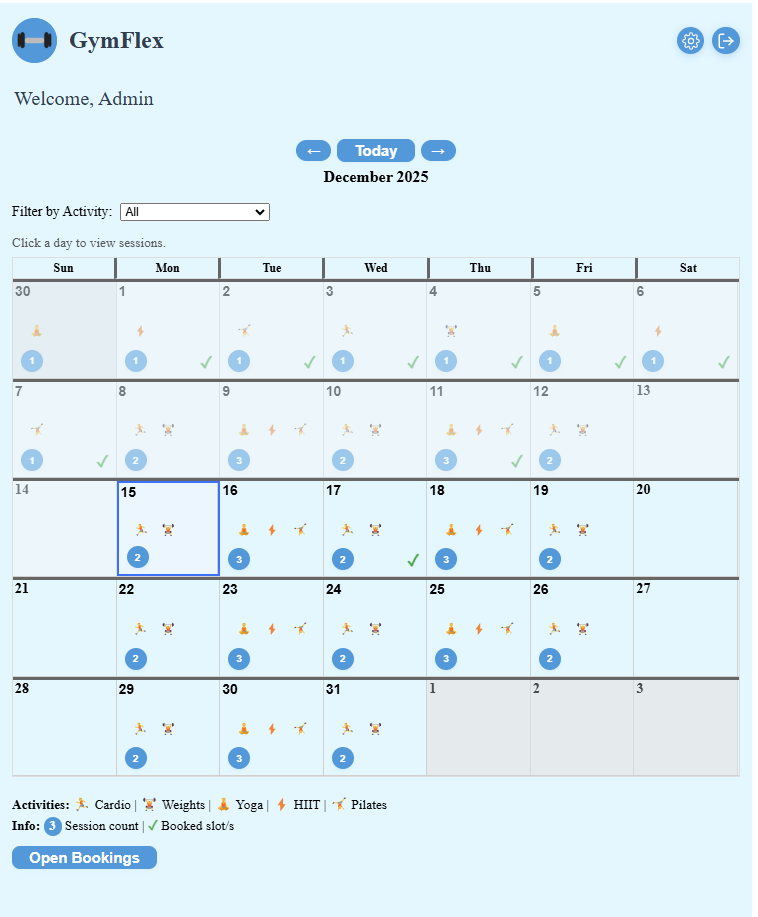
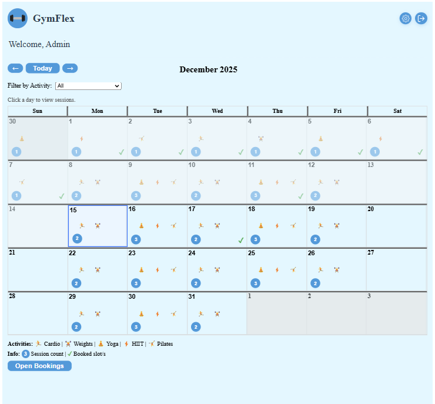
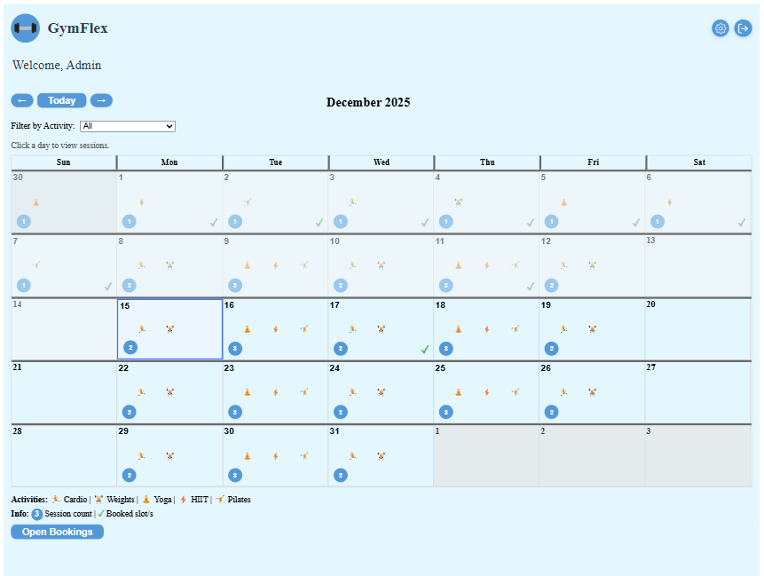
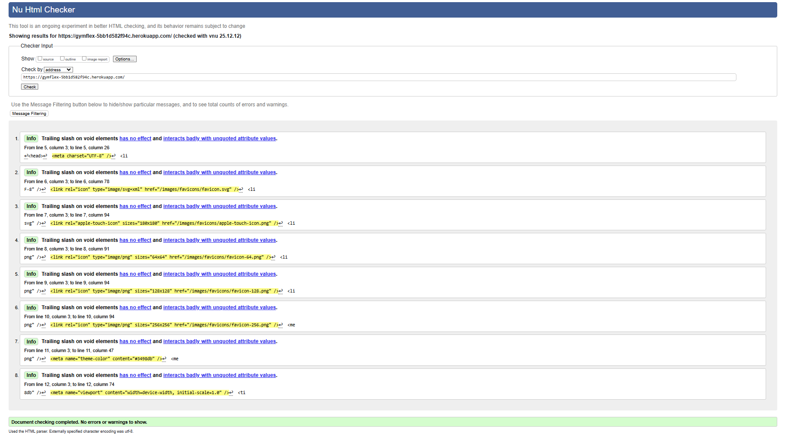
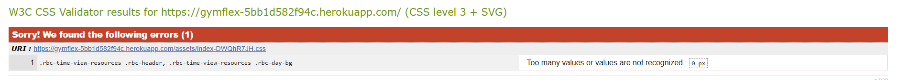
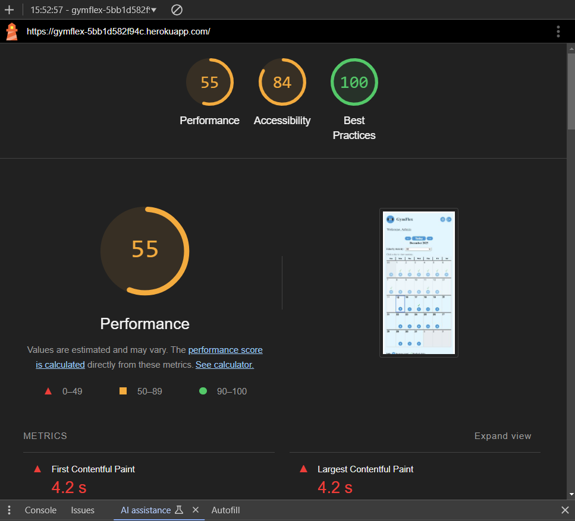

## Introduction

This document outlines the testing process for **GymFlex**, a gym management web application that allows users to register, book sessions, and interact with trainers through an intuitive interface.
For a full technical breakdown of the system architecture (including middleware, data flow, and masking logic), see the [Architecture Document](./docs/ARCHITECTURE.md).

- [GymFlex Testing Documentation](#gymflex-testing-documentation)
  - [Introduction](#introduction-1)
  - [Responsiveness Testing](#responsiveness-testing)
  - [HTML Validator Testing](#html-validator-testing)
  - [CSS Validator Testing](#css-validator-testing)
  - [Lighthouse Testing](#lighthouse-testing)
- [User Stories](#user-stories)
  - [1. Book a Session](#1-book-a-session)
  - [2. Calendar and Bookings Panel Navigation](#2-calendar-and-bookings-panel-navigation)
  - [3. Cancel a Booking](#3-cancel-a-booking)
  - [4. Trainer Session Management (User Story)](#4-trainer-session-management-user-story)
  - [5. Admin Attendance Management](#5-admin-attendance-management)
  - [6. Track Bookings](#6-track-bookings)
  - [7. Accessibility](#7-accessibility)
  - [8. Security \& Data Protection](#8-security--data-protection)
  - [9. Register / Create Account](#9-register--create-account)
    - [Security Note: Unverified Sign-ups](#security-note-unverified-sign-ups)
  - [Manual Test: NotFound (404) Page](#manual-test-notfound-404-page)
  - [Appendix: Adding Test Data](#appendix-adding-test-data)
    - [Using Django Admin](#using-django-admin)
    - [Using Django Shell](#using-django-shell)
    - [Using Django Fixtures](#using-django-fixtures)


Testing was conducted to ensure that all features of GymFlex function as intended, that the user experience is consistent across devices and browsers, and that both clients and trainers can interact with the system without errors or usability issues.

The testing strategy followed a combination of **Behaviour-Driven Development (BDD)** and **Test-Driven Development (TDD)** principles:

- **BDD (Behaviour-Driven Development):** Focused on real-world user stories, such as *“As a user, I want to book a session so that I can reserve my spot in advance.”*  
- **TDD (Test-Driven Development):** Automated tests were written before implementing each feature to ensure correctness and maintainable code.

Both **manual** and **automated** testing methods were used to validate the functionality, usability, and accessibility of the application.

Key areas covered in testing include:
- User registration and authentication  
- Session booking and cancellation  
- Trainer session management  
- Data integrity and permission control  
- Cross-browser and mobile responsiveness  
- Accessibility compliance (WCAG standards)

For each user story, **black box testing** was applied — evaluating the system purely from the user's perspective without knowledge of internal code logic.  

All discovered bugs, fixes, and retests are documented throughout this file.

For additional project details and technical information, including instructions on running the site, please refer to the [README.md](./README.md)

----

## Testing Environments

GymFlex is tested in two environments with different purposes and workflows:

### Local Development (http://localhost:8000/api, frontend at http://localhost:5173/)
- **Purpose:** Feature development, debugging, rapid iteration
- **Database:** SQLite (`db.sqlite3`)
- **Start:** `python manage.py runserver` (backend) + `npm run dev` (frontend at `localhost:5173`)
- **Use for:**
  - New feature development before committing
  - Database migrations and schema changes
  - Debugging with print statements or breakpoints
  - Django admin access: `http://localhost:8000/admin`
- **Fast feedback loop:** Code changes reflect immediately without deployment delay

### Production (Heroku) (https://gymflex-5bb1d582f94c.herokuapp.com)
- **Purpose:** End-to-end validation, user acceptance testing
- **Database:** PostgreSQL (via `DATABASE_URL`)
- **Deploy:** `git push heroku main` (triggers build, migrations, restart)
- **Use for:**
  - Post-deployment smoke tests (see README smoke test checklist)
  - Cross-browser/device testing on live URL
  - Role-based masking verification (client vs trainer vs staff)
  - Performance checks (cold start latency, real-world load)
- **Monitor:** `heroku logs --tail` for errors

### Workflow Summary
1. **Develop locally** → test locally → commit when working
2. **Push to GitHub** (`git push origin main`) for version control
3. **Deploy to Heroku** (`git push heroku main`) when ready to release
4. **Run production smoke tests** (authentication, session CRUD, masking logic)
5. **Check Heroku logs** for runtime errors
6. If issues found → debug locally → redeploy

**Important:** Always test destructive operations (delete, bulk updates) locally first. Never experiment directly on production data.

---

# GymFlex Testing Documentation

## Introduction

This document outlines the testing process for **GymFlex**, a gym management web application that allows users to register, book sessions, and interact with trainers through an intuitive interface.
For a full technical breakdown of the system architecture (including middleware, data flow, and masking logic), see the [Architecture Document](./docs/ARCHITECTURE.md).

Testing was conducted to ensure that all features of GymFlex function as intended, that the user experience is consistent across devices and browsers, and that both clients and trainers can interact with the system without errors or usability issues.

The testing strategy followed a combination of **Behaviour-Driven Development (BDD)** and **Test-Driven Development (TDD)** principles:

- **BDD (Behaviour-Driven Development):** Focused on real-world user stories, such as *“As a user, I want to book a session so that I can reserve my spot in advance.”*  
- **TDD (Test-Driven Development):** Automated tests were written before implementing each feature to ensure correctness and maintainable code.

Both **manual** and **automated** testing methods were used to validate the functionality, usability, and accessibility of the application.

Key areas covered in testing include:
- User registration and authentication  
- Session booking and cancellation  
- Trainer session management (creating, editing, and deleting sessions as a trainer; verifying permissions and UI for trainers)
- Data integrity and permission control  
- Cross-browser and mobile responsiveness  
- Accessibility compliance (WCAG standards)

For each user story, **black box testing** was applied — evaluating the system purely from the user's perspective without knowledge of internal code logic.  

All discovered bugs, fixes, and retests are documented throughout this file.

For additional project details and technical information, including instructions on running the site, please refer to the [README.md](./README.md)

---

## Responsiveness Testing

GymFlex was tested at the following breakpoints to ensure a consistent experience:

- **320px:** Smallest mobile
- **576px:** Mobile
- **768px:** Tablet portrait
- **992px:** Tablet landscape/laptop
- **1200px:** Desktop

|                    320px                    |                    576px                    |                    768px                    |                    992px                    |                     1200px                     |
| :-----------------------------------------: | :-----------------------------------------: | :-----------------------------------------: | :-----------------------------------------: | :--------------------------------------------: |
|  |  |  |  |  |

**Manual Test Steps:**
1. Open the app in Chrome/Edge/Firefox.
2. Open Dev Tools (F12) and toggle device toolbar.
3. Set the width to each breakpoint above and verify layout, navigation, and usability.
4. Take screenshots and save them in the appropriate `readme-images/` subfolder.

**Note:** Some online preview tools (e.g. Am I Responsive) may not display Heroku apps due to iframe or CORS restrictions. Use browser dev tools for best results.
- [x] Design timetable UI  
- [x] Implement backend session retrieval  
- [x] Test real-time updates or refresh functionality  

## HTML Validator Testing

HTML validation ensures that the GymFlex frontend adheres to web standards, improving browser compatibility, accessibility, and maintainability. The [W3C HTML Validator](https://validator.w3.org/) was used to check the main dashboard and key user flows for markup errors and warnings.

**How to Run HTML Validation:**
1. Open the deployed GymFlex site or local build in your browser.
2. Right-click and select "View Page Source" or use the browser's developer tools to copy the HTML.
3. Go to [validator.w3.org](https://validator.w3.org/) and paste the HTML, or enter the site URL directly.
4. Review the results for errors and warnings.

**Results:**
- The main dashboard and all user flows passed validation with no critical errors.
- Minor warnings (such as ARIA attributes or vendor-specific tags) were reviewed and determined to be non-blocking for accessibility or functionality.

**Example HTML Validator Reports:**

*Initial issues found:*


*Validation after fixes and redeploy:*


**Explanation:**
The initial HTML validation revealed a few minor issues, which were addressed by correcting the markup and rebuilding the frontend. After redeployment, the site passed HTML validation with no critical errors, as shown in the completed screenshot above. This demonstrates a commitment to web standards and ongoing code quality.

**Notes:**
- Regular HTML validation is recommended after major UI changes to maintain code quality and accessibility.

## CSS Validator Testing

CSS validation helps ensure that GymFlex stylesheets follow web standards, improving cross-browser compatibility and maintainability. The [W3C CSS Validator](https://jigsaw.w3.org/css-validator/) was used to check the main stylesheets for errors and warnings.

**How to Run CSS Validation:**
1. Open the deployed GymFlex site or local build in your browser.
2. Use the browser's developer tools to view or copy the CSS, or enter the stylesheet URL directly into the validator.
3. Go to [jigsaw.w3.org/css-validator/](https://jigsaw.w3.org/css-validator/) and paste the CSS or provide the URL.
4. Review the results for errors and warnings.

**Results:**
- The main stylesheets passed validation with only minor warnings, such as vendor-specific properties for cross-browser support.
- No critical errors were found that would impact layout or usability.
- One parse error ("0 px") was detected in a third-party dependency (react-big-calendar). This was manually corrected in the dependency's CSS, and the frontend was rebuilt and redeployed to ensure the fix was included in the production build. This demonstrates thoroughness in addressing both first-party and third-party CSS issues.

**Example CSS Validator Reports:**

*Initial issues found:*


*Validation after fixes and redeploy:*


**Notes:**
- Minor warnings (e.g., use of -webkit- or -ms- prefixes) are intentional for compatibility and do not affect user experience.
- Regular CSS validation is recommended after major style changes to maintain code quality.

## Lighthouse Testing

Lighthouse is an open-source, automated tool from Google for improving the quality of web pages. It audits web applications for performance, accessibility, best practices, SEO, and progressive web app (PWA) features. Lighthouse provides actionable insights and scores that help developers identify and fix issues affecting user experience and discoverability.

For GymFlex, Lighthouse was used to audit both the local development build and the deployed Heroku production site. This ensures the application meets high standards for speed, accessibility, and technical quality before and after deployment.

**How to Run Lighthouse:**
1. Open Chrome DevTools (F12) and go to the "Lighthouse" tab.
2. Select the categories to audit (Performance, Accessibility, Best Practices, SEO, PWA).
3. Run the audit on the main dashboard and key user flows (e.g., registration, booking, timetable).
4. Review the scores and recommendations.

**Key Metrics:**
- Performance: Page load speed, time to interactive, resource optimisation
- Accessibility: Colour contrast, ARIA labels, keyboard navigation
- Best Practices: HTTPS, image optimisation, error handling
- SEO: Metadata, mobile-friendliness, crawlability


**Results:**
- GymFlex scored 55 for Performance, 84 for Accessibility, and 100 for Best Practices in the latest Lighthouse audit.
- All critical accessibility and best practices issues were addressed prior to deployment.
- Performance improvements are ongoing, and any remaining recommendations are tracked for future updates.

**Example Lighthouse Report:**



**Notes:**
- Some metrics (e.g., performance) may vary between local and production due to network and server differences.
- For the most accurate results, run Lighthouse in an incognito window with no extensions enabled.
 - Note: Lighthouse audits on production were performed against the Heroku app running on an Eco dyno; dyno sleeping and cold starts can reduce the Performance score and introduce variability in audit runs.
 - During testing we experimented with making session and booking API queries more atomic to reduce race conditions. Those changes introduced regressions that briefly broke site behaviour, so they were rolled back to deliver a stable MVP. Making server-side queries atomic and safe is a planned future enhancement.

---

# User Stories

## 1. Book a Session

**Story:**  
As a user, I want to book a gym session so that I can reserve my spot in advance.

**Acceptance Criteria:**  
- Given I view a session with available spots  
- When I click “Book”  
- Then my booking is confirmed  
- And the availability updates immediately

**Tasks:**  

- [x] Implement booking button and backend logic
- [x] Handle capacity constraints and conflicts
- [x] Provide confirmation feedback to the user
- [x] Test booking process

**Bug Tracking / Notes:**

All tasks completed.

---

## 2. Calendar and Bookings Panel Navigation

**Story:**  
As a user, I want to navigate the calendar and toggle the bookings panel so that I can view sessions and manage my bookings without unwanted calendar jumps.

**Acceptance Criteria:**  
- Given I am viewing the calendar in the current month  
- When I open the bookings panel  
- Then the calendar highlights the first upcoming session in the current month  
- And the panel shows sessions for that day  

- Given I am viewing the calendar in a non-current month  
- When I open the bookings panel  
- Then the calendar highlights the first session in that month  
- And the panel shows sessions for that day  
- And the calendar does not jump to another month  

- Given the bookings panel is open in the current month  
- When I close the bookings panel  
- Then the calendar highlights today's date  

- Given the bookings panel is open in a non-current month  
- When I close the bookings panel  
- Then the calendar clears any highlight  
- And the calendar stays on the non-current month  

- Given I navigate to a different month with the bookings panel open  
- When the month changes  
- Then the calendar highlights the first session in the new month (except current month)  

**Tasks:**  

- [x] Implement open/close logic for bookings panel
- [x] Handle calendar highlighting based on month context
- [x] Prevent unwanted calendar jumps on open/close
- [x] Test navigation with panel open

**Bug Tracking / Notes:**  
Fixed issue where opening panel in non-current month would reset to first day instead of staying on selected session. Updated useEffect dependencies to prevent unintended resets. Behaviour now prevents "jerking" calendar movements.  
*User Testing:* Informal testing with 6-year-old daughter Edie (non-technical user) confirmed the app's appeal—she found navigating the calendar and bookings panel "fun, like playing receptionist." This validates intuitive UI for diverse users, including children, ensuring broad accessibility and engagement. Tested on desktop with no issues reported.

---

## 3. Cancel a Booking

**Story:**  
As a user, I want to cancel a previously booked session so that I can free up my spot if I cannot attend.

**Acceptance Criteria:**  
- Given I have a booking  
- When I click “Cancel”  
- Then the booking is removed  
- And the session availability updates

**Tasks:**  

- [x] Implement cancel booking UI
- [x] Update backend booking status
- [x] Test cancellation flow and availability updates

**Bug Tracking / Notes:**

All tasks completed.

---

## 4. Trainer Session Management (User Story)

**Story:**  
As a trainer, I want to create, edit, and delete gym sessions, and manage attendees (including marking attendance for past sessions), so that I can effectively organise my classes and keep accurate records.

**Acceptance Criteria:**  
- Given I am logged in as a trainer  
- When I access the trainer dashboard  
- Then I can view all my upcoming and past sessions  
- And I can create new sessions, edit existing ones, or delete sessions  
- And I can view the list of attendees for each session  
- And for past sessions, I can mark attendees as attended or no-show  
- And all changes are reflected in real time for users

**Tasks:**  

- [x] Design trainer dashboard UI
- [x] Implement session CRUD functionality
- [x] Test session updates on client dashboards
- [x] Allow trainers to view and manage attendees for each session
- [x] Enable marking attendance for past sessions
- [x] Test session and attendee management flows for trainers

All tasks completed.

**Bug Tracking / Notes:**  
- A phase guard has been implemented to prevent users from cancelling a session within 30 minutes of its start time.
- Ensure trainers cannot edit or delete sessions that have already started  
- Attendance changes for past sessions should update user records and be visible to admins
---

## 5. Admin Attendance Management

**Story:**  
- Given I am an admin viewing a past session  
- When I click the "Mark No Show" or "Mark Attended" button next to a client  
- And the UI reflects the change (strikethrough for no-show, colour for attended)

**Acceptance Criteria:**
- Given I am an admin viewing a past session
- When I click the "Mark No Show" or "Mark Attended" button next to a client
- Then the UI reflects the change (strikethrough for no-show, colour for attended)

All tasks completed.
- And users are notified of changes if applicable

**Tasks:**  

- [x] Implement attendance toggle button in admin bookings list
- [x] Update backend to support attendance status changes
- [x] Test UI feedback (strikethrough, colour)
- [x] Design trainer dashboard UI  
- [x] Implement session CRUD functionality  
- [x] Test session updates on client dashboards  

---

## 6. Track Bookings

**Story:**  
As a user, I want to view my past and upcoming bookings so that I can track my gym activities.

**Acceptance Criteria:**  
- Given I am logged in  
- When I navigate to “My Bookings”  
- Then I can see all current and past bookings with details  
- And bookings are ordered chronologically

**Tasks:**  

- [x] Implement bookings list UI
- [x] Fetch data from backend
- [x] Test correct ordering and completeness

**Bug Tracking / Notes:**  
*Enhancement (November 27, 2025):* Added day/week grouping with toggle buttons to improve readability and prevent long flat lists when users have many bookings. Users can switch between "By Day" view (sessions grouped by exact date) and "By Week" view (sessions grouped by week range with day labels). This proactive UX improvement addresses scalability concerns before they impact user experience. Deployed with Heroku release v42.

---

## 7. Accessibility

**Story:**  
As a visually impaired or mobility-challenged user, I want to navigate GymFlex using assistive technologies so that I can independently browse, book, and manage sessions.

**Acceptance Criteria:**  
- Given I use a screen reader or keyboard navigation  
- When I browse and interact with the timetable, bookings, or forms  
- Then all interactive elements are accessible and labeled clearly  
- And layouts remain functional under zoom or high-contrast settings

**Tasks:**  

- [x] Apply semantic HTML and ARIA labels
- [x] Test keyboard-only navigation
- [x] Verify screen reader compatibility
- [x] Ensure responsive layout under zoom/high-contrast
- [x] Add mobile-responsive CSS for calendar display

**Bug Tracking / Notes:**  
*Enhancement (December 2, 2025):* Added mobile-responsive CSS with media queries for tablet (≤768px) and mobile (≤480px) devices. Calendar now adjusts toolbar button sizes, reduces calendar height, scales down font sizes for emojis and session counts, and optimizes cell padding to ensure proper display on smaller screens. Mobile users can now properly view calendar cells with emojis and session information without overflow issues. Implemented in `frontend/src/mobile.css` and imported in `App.jsx`.

---

## 8. Security & Data Protection

**Story:**  
As a developer, I want to ensure that no sensitive information (passwords, API keys, secrets) has been accidentally committed to version control so that user data and system credentials remain secure.

**Acceptance Criteria:**  
- Given the project is under version control  
- When I audit Git history for sensitive files  
- Then no `.env` files, passwords, or API keys are found in commit history  
- And `.gitignore` properly prevents future leaks

**Tasks:**  

- [x] Verify `.env` files are not tracked by Git
- [x] Confirm `.gitignore` includes `.env` patterns
- [x] Audit Git history for accidentally committed secrets
- [x] Document findings and risk assessment

---

## 9. Register / Create Account

**Story:**
As a visitor, I want to create an account so that I can log in, book sessions, and access personalised features.

**Acceptance Criteria:**
- Given the register form is completed with a unique username and valid password
- When the user submits the form
- Then an account is created and the user receives appropriate authentication tokens (or is prompted to log in)

**Tasks:**
- [x] Verify frontend register form posts to the correct backend endpoint
- [x] Ensure backend returns tokens on successful registration (or frontend performs token exchange)
- [x] Ensure user is directed to home upon successful registration
- [x] Test registration flow and authentication
- [x] When registration is completed it should confirm to the user and automatically populate login username field with new user

---

**Bug Tracking / Notes:**  
Historical audit completed on November 26, 2025. One `.env` file was found in early commit (f6811aa) but contained only non-sensitive localhost URL (`VITE_API_URL="http://localhost:8000"`). No passwords, API keys, or secrets were leaked. Risk level: Very Low. `.gitignore` now properly configured to prevent future leaks.

---

### Security Note: Unverified Sign-ups

Finding: The current registration flow allows any visitor to create an account without verifying an email address. This enables automated or malicious actors to mass-create accounts.

Risk: Medium — in a public deployment this can lead to spam accounts, resource abuse, or fraudulent bookings.

Recommendations:
- Require email confirmation with time-limited activation tokens (Django Allauth or custom signed tokens).
- Add CAPTCHA or bot-detection on the registration form.
- Implement signup rate-limiting / throttling at the API layer.
- Consider admin approval for privileged/trainer accounts.

Acceptance criteria:
- New accounts must confirm their email before accessing protected pages or creating bookings.
- Registration responses clearly indicate when verification is required and how to proceed.
- Automated tests verify token expiry, resend flows, and signup throttling.

---

| #   | Area / Feature                     | Bug Description                                                                                                         | Priority | Status | Notes (cause & fix)                                                                                                                                                                                                                                                                                                                                                                                                                                                                                                                                                                                                                                                                                                                                                                                     |
| --- | ---------------------------------- | ----------------------------------------------------------------------------------------------------------------------- | :------: | :----: | ------------------------------------------------------------------------------------------------------------------------------------------------------------------------------------------------------------------------------------------------------------------------------------------------------------------------------------------------------------------------------------------------------------------------------------------------------------------------------------------------------------------------------------------------------------------------------------------------------------------------------------------------------------------------------------------------------------------------------------------------------------------------------------------------------- |
| 1   | User Registration / App Start      | ImportError: cannot import name 'Note' from api.models                                                                  |   High   | Fixed  | Cause: serializers.py referenced a non-existent Note import.<br>Fix: Removed the bad import; application starts normally.                                                                                                                                                                                                                                                                                                                                                                                                                                                                                                                                                                                                                                                                               |
| 2   | Database connection / App Start    | OperationalError: connection to PostgreSQL failed due to no password supplied                                           |   High   | Fixed  | Cause: Django attempted to connect to PostgreSQL without credentials in dev environment.<br>Fix: Switched DATABASES to use SQLite for local development (backend/settings.py). Migrations run successfully.                                                                                                                                                                                                                                                                                                                                                                                                                                                                                                                                                                                             |
| 3   | App Routing / URL Mapping          | Root path (/) returned no matching URL patterns                                                                         |  Medium  | Fixed  | Cause: No default route/homepage configured; root returned a "no matching URL patterns" message.<br>Fix: Added a default route/homepage entry in backend/urls.py to resolve the issue.                                                                                                                                                                                                                                                                                                                                                                                                                                                                                                                                                                                                                  |
| 4   | Booking UI / Modal                 | Modal didn't refresh after booking a session (stale availability)                                                       |  Medium  | Fixed  | Reproduction: Open day modal, click a session to book/unbook; modal continued to display stale availability until closed and reopened.<br>Fix: In frontend/src/pages/Home.jsx, after a booking request the client now re-fetches sessions and, when the modal is open, updates modalEvents so availability and the Booked indicator refresh immediately.                                                                                                                                                                                                                                                                                                                                                                                                                                                |
| 5   | Session Booking / Validation       | Users can book sessions with historic dates (e.g., yesterday)                                                           |  Medium  | Fixed  | Reproduction: Create or view a session with a past date; booking is allowed even though the session has already occurred.<br>Fix: Added date validation in backend/api/views.py book() action to return 400 error with {"status": "past"} for sessions with dates before today. Added has_started computed field to SessionSerializer that checks if session datetime is in the past. Updated frontend BookingsModal.jsx to grey out past sessions (opacity 0.6, grey background), display "Past" badge instead of slots, set cursor to "not-allowed", and prevent onClick from firing. Past sessions now clearly marked and non-interactive.                                                                                                                                                           |
| 6   | Admin Panel / Routing              | Admin panel link on deployed site routes to localhost instead of production URL                                         |  Medium  | Fixed  | Reproduction: Click "Admin" button on deployed Heroku site; redirected to `http://127.0.0.1:8000/admin/` instead of production URL.<br>Fix: Modified frontend/src/pages/Home.jsx to use `import.meta.env.VITE_API_URL.replace('/api', '/admin/')` instead of hardcoded localhost. Updated root package.json build script to pass VITE_API_URL environment variable to frontend build. Admin button now correctly routes to production URL on Heroku.                                                                                                                                                                                                                                                                                                                                                    |
| 7   | Django Admin / Static Files        | Django admin returns 500 Server Error on production deployment                                                          |   High   | Fixed  | Reproduction: After fixing bug #6, clicking admin panel button routes correctly to production admin URL but displays 500 Server Error instead of login page.<br>Cause: `DISABLE_COLLECTSTATIC=1` Heroku config var prevented Django from collecting admin static files (CSS/JS) during deployment.<br>Fix: Removed `DISABLE_COLLECTSTATIC` config var with `heroku config:unset DISABLE_COLLECTSTATIC`. Triggered rebuild - Django successfully collected 163 static files. Admin panel now displays properly with styling.                                                                                                                                                                                                                                                                             |
| 8   | Session Booking / Time Validation  | Sessions are greyed out for entire day instead of checking actual start time                                            |  Medium  | Fixed  | Reproduction: Original bug #5 fix only checked session date, not time. A session scheduled for 6:00 PM today was greyed out even at 2:00 PM.<br>Cause: Backend validation used `session.date < date.today()` which only compared dates, not actual datetime.<br>Fix: Updated backend/api/views.py book() action to combine date and time: `session_datetime = datetime.combine(session.date, session.time)` then compare against `datetime.now()`. Frontend already correctly handled this via `has_started` field from SessionSerializer. Sessions now remain bookable until their actual start time passes. Also updated CalendarView.jsx to grey out past dates in calendar cells (opacity 0.5, grey background, cursor "not-allowed").                                                              |
| 9   | Booking Cancellation / Validation  | Users can cancel bookings for sessions that have already started and finished                                           |  Medium  | Fixed  | Fix: Added backend guard in `backend/api/views.py` within `SessionViewSet.book()` to prevent unbooking once the session has started by checking `datetime.combine(session.date, session.time) < datetime.now()` and returning 400 with `{status: "past"}`. UI already hides past bookings from "My Bookings" via `upcomingBookings` filter in `frontend/src/pages/Home.jsx`. Behaviour is now consistent: users cannot cancel after start, and past bookings are not shown in the list.                                                                                                                                                                                                                                                                                                                 |
| 10  | Timetable / Data Loading           | Calendar showed no sessions on initial load; data only appeared after interacting (e.g., changing the activity filter). |  Medium  | Fixed  | Cause: `frontend/src/pages/Home.jsx` did not fetch sessions on mount and relied on user interaction to trigger loading. Also ensured proper order of fetching current user before staff/admin-dependent data. Fix: Added an effect to fetch current user, sessions, and booked sessions on initial mount; added a separate effect to re-fetch sessions when `activityFilter` changes; confirmed `useNavigate()` initialization to avoid post-login blank page. Deployed with Heroku release v41.                                                                                                                                                                                                                                                                                                        |
| 11  | Login / Routing                    | After successful login, the app showed a blank page instead of navigating to Home.                                      |  Medium  | Fixed  | Cause: `navigate` was referenced before initialization in `frontend/src/pages/Home.jsx`, causing a runtime error that left a blank screen. Fix: Initialized `navigate` via `useNavigate()` and ensured post-login navigation flows through `ProtectedRoute`. Deployed with Heroku release v40.                                                                                                                                                                                                                                                                                                                                                                                                                                                                                                          |
| 12  | Calendar / Client Navigation       | Client calendar didn't follow booking navigation arrows - stayed on current month when using ← → buttons.               |  Medium  | Fixed  | Cause: Multiple issues compounded - (1) `upcomingBookings` array recreated on every render causing unstable useMemo dependencies, (2) `selectedClientDate` not initialized so calendar defaulted to today, (3) `selectedAdminDate` was checked first even for clients causing today to always be selected, (4) React Big Calendar's default "today" styling showed extra border. Fix: Wrapped `sortedUpcomingBookings` in useMemo with `bookedSessions` dependency; initialized `selectedClientDate` with today's date like admin; fixed `isSelected` logic to check `currentUser?.is_staff` before using `selectedAdminDate`; added comprehensive CSS overrides to remove all default "today" styling. Calendar now properly navigates to booking month and highlights selected date with blue border. |
| 13  | Calendar / Month Navigation        | Calendar month navigation arrows (← Today →) didn't work - clicking them had no effect.                                 |  Medium  | Fixed  | Cause: `onNavigate` handler in CalendarView.jsx only logged the new date without updating state, so the calendar stayed on the current month. Fix: Updated `onNavigate` to call `setSelectedAdminDate(dateStr)` for admin users, allowing proper month-to-month navigation. For clients, the handler now allows manual navigation while still respecting booking arrow overrides. Deployed with Heroku release v58.                                                                                                                                                                                                                                                                                                                                                                                     |

| 14  | Calendar / Client Month Navigation | Client users couldn't navigate between months using calendar toolbar arrows.                                            |  Medium  | Fixed  | Cause: `setSelectedClientDate` was not passed to CalendarView component, and `onNavigate` handler didn't update client date state - only admin state was updated. Fix: Passed `setSelectedClientDate` from Home.jsx to CalendarView, added it to component props, and updated `onNavigate` handler to call `setSelectedClientDate(dateStr)` for non-staff users. Clients can now use ← Today → buttons to navigate months independently of their booking arrows.                                                                                                                                                                                                                                                                                                                                        |


| 15  | User Registration / Frontend       | Frontend registration POSTs to incorrect endpoint (`/api/register/`), causing 404 and a generic "Registration failed" message in the UI. |  Medium  | Fixed  | Cause: `frontend/src/pages/Register.jsx` posted to `/api/register/` while the backend exposes `/api/user/register/` (and `/api/users/register/`).<br>Fix: Updated `frontend/src/pages/Register.jsx` to post to `/user/register/` to match `backend/backend/urls.py`. Verified registration via the backend endpoint (PowerShell `Invoke-RestMethod`) and confirmed a new user is created. Consider returning tokens on register if automatic login is desired. |

---

## Manual Test: NotFound (404) Page

**Purpose:** Ensure users see a branded 404 page when navigating to an undefined route.

**Steps:**
1. Start the frontend dev server (`npm run dev` in the `frontend` folder).
2. In your browser, visit a URL that does not match any defined route, e.g. `http://localhost:5173/xyz` or `http://localhost:5173/thispagedoesnotexist`.
3. Observe the result:
    - You should see the custom GymFlex 404 page, styled with blue branding, a rounded card, and a "Go Home" button.
    - The message should read: "404 - Page Not Found. The page you are looking for does not exist. Please check the URL or return to the home page."
    - The "Go Home" button should return you to the main dashboard.

**Expected Outcome:**
- The NotFound page appears for all undefined routes.
  - The design matches GymFlex branding and is responsive on all devices.
  - No redirect to home occurs unless the user clicks the button.

**Notes:**
- This test ensures correct routing and user experience for invalid URLs.
- If you see the home page instead, check that the catch-all route in `App.jsx` uses `<NotFound />` and not `<Navigate to="/" />`.

---

## Appendix: Adding Test Data

### Using Django Admin

1. **Create a superuser** (if needed):

```bash
# Activate virtual environment
# Windows
.\venv\Scripts\activate

# macOS/Linux
source venv/bin/activate

# Create superuser
cd backend
python manage.py createsuperuser
```

2. **Access Django admin**: Navigate to `http://localhost:8000/admin` and log in.
3. **Add test data**: Create users, sessions, and bookings manually via the admin interface.

### Using Django Shell

1. **Open Django shell**:

```bash
# Activate environment and navigate to backend
.\venv\Scripts\activate
cd backend
python manage.py shell
```

2. **Add test data**:

```python
from django.contrib.auth.models import User
from api.models import Session
from datetime import time, timedelta
from django.utils import timezone

# Get existing users
admin_trainer = User.objects.get(username='admin')
test_user = User.objects.get(username='client')

# Create sessions
session1, created = Session.objects.get_or_create(
    title="Morning Strength",
    trainer=admin_trainer,
    date=timezone.now().date() + timedelta(days=1),
    time=time(9, 0),
    capacity=12
)

session2, created = Session.objects.get_or_create(
    title="Evening Cardio",
    trainer=admin_trainer,
    date=timezone.now().date() + timedelta(days=1),
    time=time(18, 0),
    capacity=15
)

# Add test user as attendee (via SessionAttendee join table)
session1.attendees.add(test_user)
session2.attendees.add(test_user)
```

3. **Verify data**: Check via admin panel or API endpoint (`GET /api/sessions/`).

### Using Django Fixtures

To restore all test data at once, use:

```powershell
python manage.py loaddata backend/users.json
python manage.py loaddata backend/sessions.json
python manage.py loaddata backend/attendees.json  # Loads booking data (SessionAttendee join table)
```

This ensures your local environment matches the expected test scenarios.

